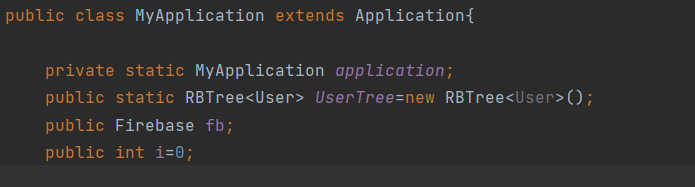
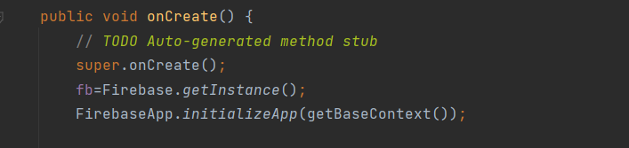
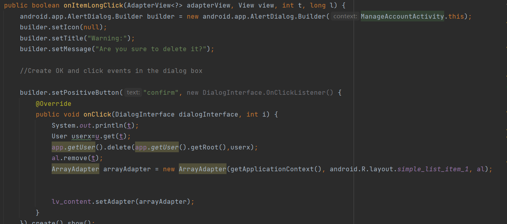
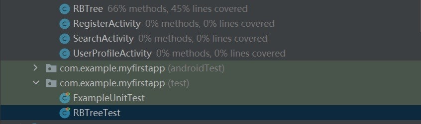

# [HENUers] Report

## Table of Contents

1. [Team Members and Roles](#team-members-and-roles)
2. [Summary of Individual Contributions](#summary-of-individual-contributions)
3. [Conflict Resolution Protocol](#conflict-resolution-protocol)
4. [Application Description](#application-description)
5. [Application UML](#application-uml)
6. [Application Design and Decisions](#application-design-and-decisions)
7. [Summary of Known Errors and Bugs](#summary-of-known-errors-and-bugs)
8. [Testing Summary](#testing-summary)
9. [Implemented Features](#implemented-features)
10. [Team Meetings](#team-meetings)

## Team Members and Roles

| UID | Name | Role |
| :--- | :----: | ---: |
| [u7385305] | [Zhaoyu Cao] | [Developer(Function)] |
| [u7341252] | [Enze Peng] | [Developer(Database)] |
| [u7370885] | [Yonghao Deng] | [Developer(Function),PM] |
| [u7354208] | [Zihan Meng] | [Developer(Front-End design)] |

## Summary of Individual Contributions

u7385305, Zhaoyu Cao, I contribute 25% of the code. Here are my contributions:
* LoginActivity.class
* ContentActivity.class
* UserProfileActivity.class
* Firebase.class
* Report Writing: Conflict Resolution Protocol, Application UML, Summary of Known Errors and Bugs

u7341252, Enze Peng, I contribute 25% of the code. Here are my contributions:
* MainActivity.class: use the HashMap data structures
* MyApplication.class: use the RBTree store the user's data
* database_class: Comment.class,Post.class,ThumbUp.class
* Parser: E_evaluate.class,P_evaluate,TopicCheck : use the Tokenizer to check
* PostActivity.class
* Report Writing: Application Design and Decisions
* Slide preparation: All of the slides

u7370885, Yonghao Deng, I contribute 25% of the code. Here are my contributions:
* MyPostActivity.class: use the HashMap data structures
* SearchActivity.class: use the HashMap data structures
* RegisterActivity.class: use the Tokenizer to restricted registration conditions
* iterater.class: use the iterater design patterns
* container.class
* Report Writing: Summary of Individual Contributions,Team Meetings,Application Description

u7354208, Zihan Meng, I contribute 25% of the code. Here are my contributions:
* activity_content.xml
* activity_login.xml
* activity_main.xml
* activity_my_post.xml
* activity_neraby.xml
* activity_post.xml
* activity_register.xml
* activity_search.xml
* activity_user_profile.xml
* list_item_layout.xml
* MainActivity.class
* Report Writing: Implemented Features, Team Members and Roles

*[Code Design. What design patterns, data structures, did the involved member propose?]*

*[UI Design. Specify what design did the involved member propose? What tools were used for the design?]*

*[Report Writing. Which part of the report did the involved member write?]*

*[Slide preparation. Were you responsible for the slides?]*

*[Miscellaneous contributions. You are welcome to provide anything that you consider as a contribution to the project or team.]*

## Conflict Resolution Protocol
When our group encounters conflict:

1. Conduct an emergency meeting to discuss the causes of the problem and document them
2.  -  In the initial discussion if we can unify the ideas of each member of the group, then we will directly make changes in the code.
    -  In the initial discussion if we can not unify the ideas of each member of the group, we will review online materials or ask our tutors to    finalize our uniform version.

## Application Description

Treehole is a social media application for college students that provides a platform for each college student to share their daily life or thoughts. Users can also view posts sent by others and like or comment on them after viewing them for the purpose of making friends and communicating with them, which helps students' mental health development.

**Application Use Cases**

There are two user case diagrams to show our application. One is for user,and the other is for administrator.

  

Here is a Treehole application example

Lisa is a student from China who is in his first year at the Australian National University and this is his first year in Australia.
1. After living away from Lisa's parents in Australia for three months for the first time, she missed her parents very much
2. Lisa posted a post about her feelings about coming to Australia for the past three months and how much she misses her home and family.
3. Carmelo saw Lisa's post, he first liked Lisa's post, then wrote a lot of comforting sentences in the comment section, and promised to go out with Lisa one weekend afternoon

Targets Users: Students

* Users can send their daily life to share with others.
* Users can send their thoughts at any time, such as their love of food, thoughts of home, appreciation of others, etc.
* Users can send some comments and opinions about the school.

Target Users: Teachers,Faculty and Staff

* Users can view suggestions for the school and make improvements.
* Users can monitor students' psychological status and provide online counseling for students with psychological problems.
* Users can delete the posts or users which they think bad.

**Application manual**

Our application has two groups, one for users and one for administrators.

For user, we provide several functions:

**1. Login:** User can login our app to enjoy it. User should input their name and password to achieve the login process. 

By default, we have some initial users that can login, which is stored in loginDetail.csv file. Here are username and password that can help you login below. 
- Eric,Au123456
- Carmelo,Au123456
- Arthur,Au123456
- Simon,Au123456
- Ben,Au123456
- Greg,Au123456
- Eden,Au123456
- John,Au123456
- Amos,Au123456

  

**2. Register:** We allow people to register our app, and the registration information need to include name, e-mail, phone number, password.

We have a bug in this part, so while using this APP, you can use the user and password provided above to use the app.

  

**3. Search a post:** Our app allows user to search for the posts they want. In addition, there are two principles to search for posts.

- When user want to search for keywords in the title, they need to add # in front of the keywords.For example, if I want to search for “today” in the title, I need to input “#today” in the search box.

  

- When user want to search for keywords in the content, they need to add * in front of the keywords. For example, if I want to search for “day” in the content, I need to input “*day” in the search box.

  

- When user want to search for keywords in the content and title as a double limit, they need to add * and # in front of the keywords. For example, if I want to search for “day” in the title and “friend” in the content, I need to input “#day*friend” in the search box. The order is not important, but there can be no space between them.

  

**4. User profile:** The page records user information, including user name, e-mail, location. User can also log out the app in this page.

  

- GPS: User can locate their position in this page. They just need to click the location button to achieve it. It will show the city name and the province name.

  

**5. Manage posts**

- Delete posts: User can manage their posts in our app. In the main page, they need to click the first item at the top of bar to enter, and then click the post they want to delete, there is a delete button on the bottom of the bar. While clicking it, there will be a pop-up window to remind user and then they can decide whether to delete the post. If user want to cancel this operation, they just need to click the space out of pop-up window.

  

**6. Post new posts**: In the main page, if user want to post new posts, they just click on ‘paper airplane’ icon and then enter the page. In this page, user can set the title and content that they want to post.

  

**7. Browse the posts**: In the main page, user can look through all the posts. In addition, they can thumb up a post and comment a post after clicking a post. 

- Thumb up a post: If user like a post, they just click ‘heart’ icon to like it and then the ‘heart’ icon will full of orange.

  

- Comment a post: If user comment a post, they just need to input the comment they want and then click the first item at the bottom of the bar to finish commenting.

  

For administrators, they can act as a normal user and use all the functions of users.In addition, they can manage accounts about users. 

1. Manage accounts: administrators can delete users in the user-profile page. While deleting user, they need to long press on user name and then there will be a pop-up window to remind them whether to delete this user.

  

## Application UML

## Application Design and Decisions

**Data Structures**

1. Maps

   * Objective: It is used for storing required posts to be displayed in a Listview

   * Locations: 
         
      app\src\main\java\com\example\myfirstapp\MyPostActivity

      app\src\main\java\com\example\myfirstapp\ MainActivity

      app\src\main\java\com\example\myfirstapp SearchActivity

   * Reasons:

      Hashmaps is able to store key/value pairs which exactly fit storing the post that needs to store different features:

      key: “post title” -> value “data”

      key: “post content” -> value “data”

    
2. Arraylists

   * Objective: It is used for storing simple strings to be displayed in a Listview

   * Locations: app\src\main\java\com\example\myfirstapp\ ManageAccountActivity

   * Reasons:

      Arraylists is able to store simple item such as string as an ordered list. Then use the iterator pattern to print out.

      User delete functions in ManageAccountActivity.

3. Red-Black Tree

   * Objective: It is used for all user information to make users stored in efficient data structure.

   * Locations:
         
      app\src\main\java\com\example\myfirstapp\ RBTree

      app\src\main\java\com\example\myfirstapp\ MyApplication

   * Reasons:

      To meet the requirement of app design, a new structure needs to be done. Red-black tree is a perfect data structure to make all-users be read ,stored, deleted and added efficiently

      Abstract-type RBTree designed in RBTree.java

      Global instance created in MyApplication.java

**Design patterns**

4. Singleton patterns

   * Objective: It is used for create the class where only one instance of a class is created in all project file.

   * Locations: app\src\main\java\com\example\myfirstapp\ Firebase

   * Reasons: In one application of project, once created, there will be only one instance of firebase instance from beginning to the end. So singleton pattern is perfectly suitable to be used in such a class.

5. Iterator patterns

   * Objective: A method for accessing collections that can be used to iterate over collections like ArrayList and HashSet.

   * Locations: 
         
      app\src\main\java\com\example\myfirstapp\ iterator

      app\src\main\java\com\example\myfirstapp\ManageAccountActivity

   * Reasons:

      For all ordered data stored structure, iterator provides A method to access elements of a container object without exposing the inner details of the object, which maintain the security of data.

      Main structure of iterator: iterator directory

      Used in ManageAccountActivity

6. Factory patterns

   * Objective: Define an interface for creating objects, let subclasses decide which class to instantiate, and factory methods defer the instantiation of a class to its subclasses.

   * Locations: app\src\main\java\com\example\myfirstapp\ userCollection

   * Reasons: In user class to extend similar operations, only a new user class can be inherited, and the client only needs to understand the abstract Product and factory, simplifying use and extension.
      
7. State patterns:

   * Objective: Allows an object to change its behavior when its internal state changes, and the object appears to modify its class.

   * Locations: app\src\main\java\com\example\myfirstapp\userCollection\userstate

   * Reasons:

      The behavior of a class changes based on its state. This type of design pattern is behavioral. For the user class, users are meant to behave differently in different state. For example: login user can post and manage its own account, log out user cannot do anything except login.

      Used in all the user(one of user’s attribute)

**Tokenizer and Parsers**

* In our project: we use Tokenizer and Parsers in both search function and registering checking function.

1) Search function:

   * a. We create the rules of search function:
         
         “#”+topic

         “*”+content

      All pairs can be arrange in different orders with many times:

         "#day*nice#work"

         "*good#sad"
      

   * b. How it works:
      
      1. From the rules, we get a string as a input

      2. From basic tokens:

         enum Type:

            {INT,AT,LETTER,DOT,COM,CAPLETTER,HEX,STAR}

         Tokenize input into a collection of tokens

      3. Use TopicCheck as parser in parser folder to parse tokens into pieces we need

2) Registering checking

   * a. We create the rules of search function:
         
      [int and letter][AT][LETTER][.][COM]

   * b. How it works:
         
      1. From the rules, we get random email or password written from front-end as a input

      2. From basic tokens:

         enum Type:

            {INT,AT,LETTER,DOT,COM,CAPLETTER,HEX,STAR}

         Tokenize input into a collection of tokens

      3. Use E-evaluate and  as parser in parser folder to parse tokens to Count dot and @.Check Tokens before @ between dot ,between dot and @ after dot needs COM tokens.Return false exception message.

**Grammar(s)**
  Production Rules  

* 1. Registering check

   Email::={INT,LETTER },[AT],[LETTER],[.],[COM];

   Password::=[CAPLETTER][LETTER AND INT];

* 2. Search

   Search::= {Topic|Content};

   Topic::= [HEX],{LETTER|INT};

   Content::= [STAR],{LETTER|INT};
* For registering check:

   Need to check tokens and then evaluate them to give wrong messages.We basically create tokens in order and than first find out @ AND DOT,Split into terms. During the traverse of tokens, counting to @ AND DOT needs to be done. From different steps: we evaluate and print error message.

Evaluation:

      1. if (count_at>1) "More than two '@' in email"

      2. if (count_dot>1) "More than two '.' in email"

      3. if(count_at==0),should use @ in email"

      4. if(count_dot==0)should use '.' in email")

      5. if !back_s.equals("com") should use 'com' in email

      6. if(count_at==0&&count_dot==1)dot can't be front of @ in email"

* For search function:

   We basically get tokens starting from HEX and STAR and categorize them into two parts Topic and Content. Use collections of Tokens belonging to HEX and collections of Token belonging to STAR to do the firebase search.

**Surpise Item**
1. Surpise Item1

   * Problem: 
         
      1. Users are extracted from local file once app beginning, it is wasting time if read file every time needs to use all-users in red-black tree. 

      2. Users should be stored in red-black tree, but once constructed RBTree, it is complicated and space-wasted to transfer this instance of RBtree users to all the activities if needed.(use intent to putextra )

      3. To get posts from firebase, we needs to traverse

   * Solution: so a global dynamic variable is necessarily needed to exist in all the    activities( or such an instance can be called and used in all the activities)
         
      1.	The first thing I need to do is rewrite the Application, mainly the onCreate method inside of it, which initializes a Map when it's created so that any values can be inserted. This variable can then be manipulated in various files throughout the application.

      
  

      
  

      2. There are two ways to get the app in the program: getInstance() and getApplication() in the four major components

      3.	So in all activities: to get this global var MyApplicaiton, use getInstance() to get instance which dynamically changed by all the works from different activities.

2. Surpise Item2

   * Problem: In ManageAccountActivity, we needs to create Listview where all the items needs have a button 
If we create buttons for all the items listed in Listview, it will be nasty to handle because
         
      1. It is kind of tough to create buttons dynamically according to the number of items. Because we needs to  get connected between functions and views.
 

      2. Even we create buttons for all listed views , buttons needs to be treated differently as to assign different ids to them.

   * Solution: 
         
      1.	setOnItemLongClickListener to set up longclick in  Listview  to avoid creating buttons. 

      2. Then create app.AlertDialog to show the confirming windows in order to fulfill funcitons.

      
  

## Summary of Known Errors and Bugs

1. Bug 1:

- In user profile page, for GPS function, we use Geocoder library to achieve it. 
- The emulator cannot locate your position ahead of time, so we need to go to MORE section of the emulator and set the point ahead of time.
- Zhaoyu Cao and Yonghao Deng use API 30 and Pixel 4 emulator can run this function on their computers. However, Zihan Meng and Enze Peng cannot run this function and error saying that “Java.io.IOException: grpc failed”.

2. Bug 2:

- There are four administrators including Eric, Carmelo, Arthur, and Simon that can manage accounts.
- While deleting a user there will be a pop-up window.
- While clicking “CANCEL” at the pop-up window, the window will not disappear and we need to click other part out of pop-up window to return the page.
- While long clicking “CONFIRM” at the pop-up window, the user will deleting from our database. However, when we return and click “MANAGE ACCOUNTS”, there will be repeated items to load in the page.
- Actually the user is already deleted.

3. Bug 3:

- While using searching, our function only can visualize the result. If you click on the post after searching, the page will be blank and even the application will crash.

4. Bug 4:

- While registering a new user, even though all the information is in right format, while clicking sign up, the application sometimes will crash.

## Testing Summary

Features：Insertion and deletion of red-black trees

Number of test cases: 53

Code coverage: 66%

Types of tests created: Normal function

  

## Implemented Features

**Part 1: Basic App**
1. Users must be able to login (not necessarily sign up).
2. Users must be able to load data/information (from file(s) or Firebase) and visualise it.
3. Users must be able to search for information on your app. The search functionality must make use of a tokenizer and parser with a formal grammar of your own creation.
4. There must be a data file with at least 2,500 valid data instances(in the firebase).

**Part 2: Additional features**

Greater Data Usage, Handling and Sophistication
1. Feature 1: Read data instances from multiple local files in different formats (JSON, XML or Bespoken). (easy)
2. Feature 2: User profile activity containing a media file (image, animation (e.g. gif), video). (easy)
3. Feature 3: Use GPS information (see the demo presented by our tutors. For example, your app may use the latitude/longitude to show some information relevant to your app). (easy)
4. Feature 4: Report viewer. Provide users with the ability to see a report of interactions with your app (e.g., total views, total likes, total raised for a campaign, etc, in a graphical manner.(medium)
5. Feature 5: Deletion method of either a Red-Black Tree, AVL tree or B-Tree data structure. The deletion of nodes must serve a purpose within your application. (hard)

User Interactivity
1. Feature 1: The ability to micro-interact with items in your app (e.g. like/dislike/support/report a post/message/event) [stored in-memory]. (easy)
2. Feature 2: Scheduled actions. At least two different types of actions must be schedulable. For example, a user can schedule an item (e.g., launch a social cause, like an item, post a comment, etc). (medium)

Firebase Integration
1. Feature 1: Use Firebase to implement user Authentication/Authorisation. (easy)
2. Feature 2: Use Firebase to persist all data used in your app (this item replaces the requirement to retrieve data from a local file) (medium)
3. Feature 3: Using Firebase or another remote database to store user information and having the app updated as the remote database is updated without restarting the application. 
   E.g. User A makes a transfer, user B on a separate instance of the application sees user A’s transfer appear on their app instance without restarting their application. (very hard)
   
## Team Meetings

- [Team Meeting 1](./Meeting01.md)
- [Team Meeting 2](./Meeting02.md)
- [Team Meeting 3](./Meeting03.md)
- [Team Meeting 4](./Meeting04.md)

