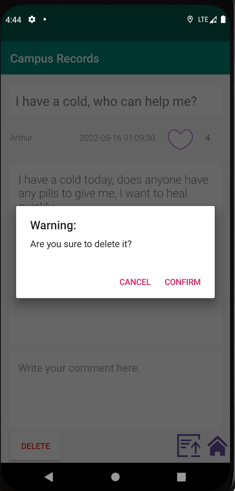

# [HENUers] Report

The following is a report template to help your team successfully provide all the details necessary for your report in a structured and organised manner. Please give a straightforward and concise report that best demonstrates your project. Note that a good report will give a better impression of your project to the reviewers.

*Here are some tips to write a good report:*

* *Try to summarise and list the `bullet points` of your project as many as possible rather than give long, tedious paragraphs that mix up everything together.*

* *Try to create `diagrams` instead of text descriptions, which are more straightforward and explanatory.*

* *Try to make your report `well structured`, which is easier for the reviewers to capture the necessary information.*

*We give instructions enclosed in square brackets [...] and examples for each sections to demonstrate what are expected for your project report.*

*Please remove the instructions or examples in `italic` in your final report.*

## Table of Contents

1. [Team Members and Roles](#team-members-and-roles)
2. [Summary of Individual Contributions](#summary-of-individual-contributions)
3. [Conflict Resolution Protocol](#conflict-resolution-protocol)
4. [Application Description](#application-description)
5. [Application UML](#application-uml)
6. [Application Design and Decisions](#application-design-and-decisions)
7. [Summary of Known Errors and Bugs](#summary-of-known-errors-and-bugs)
8. [Testing Summary](#testing-summary)
9. [Implemented Features](#implemented-features)
10. [Team Meetings](#team-meetings)

## Team Members and Roles

| UID | Name | Role |
| :--- | :----: | ---: |
| [u7385305] | [Zhaoyu Cao] | [Developer(Test)] |
| [u7341252] | [Enze Peng] | [Developer(Database)] |
| [u7370885] | [Yonghao Deng] | [Developer(Function),PM] |
| [u7354208] | [Zihan Meng] | [Developer(Front-End design)] |

## Summary of Individual Contributions

*[Summarise the contributions made by each member to the project, e.g. code implementation, code design, UI design, report writing, etc.]*

*[Code Implementation. Which features did you implement? Which classes or methods was each member involved in? Provide an approximate proportion in pecentage of the contribution of each member to the whole code implementation, e.g. 30%.]*

*u7385305, Zhaoyu Cao, I contribute 25% of the code. Here are my contributions:*
* LoginActivity.class
* ContentActivity.class
* UserProfileActivity.class
* Report Writing: 
* Slide preparation: 

*u7341252, Enze Peng, I contribute 25% of the code. Here are my contributions:*
* MainActivity.class
* MyApplication.class
* Post.class
* PostActivity.class
* Report Writing: 
* Slide preparation: 

*u7370885, Yonghao Deng, I contribute 25% of the code. Here are my contributions:*
* MyPostActivity.class: use the HashMap data structures
* SearchActivity.class: use the HashMap data structures
* RegisterActivity.class: use the Tokenizer to restricted registration conditions
* iterater.class: use the iterater design patterns
* container.class
* Report Writing: 
* Slide preparation: 

*u7354208, Zihan Meng, I contribute 25% of the code. Here are my contributions:*
* activity_content.xml
* activity_login.xml
* activity_main.xml
* activity_my_post.xml
* activity_neraby.xml
* activity_post.xml
* activity_register.xml
* activity_search.xml
* activity_user_profile.xml
* list_item_layout.xml
* MainActivity.class
* Report Writing: 
* Slide preparation: 

*[Code Design. What design patterns, data structures, did the involved member propose?]*

*[UI Design. Specify what design did the involved member propose? What tools were used for the design?]*

*[Report Writing. Which part of the report did the involved member write?]*

*[Slide preparation. Were you responsible for the slides?]*

*[Miscellaneous contributions. You are welcome to provide anything that you consider as a contribution to the project or team.]*

## Conflict Resolution Protocol
When our group encounters conflict:

1. Conduct an emergency meeting to discuss the causes of the problem and document them
2.  -  In the initial discussion if we can unify the ideas of each member of the group, then we will directly make changes in the code.
    -  In the initial discussion if we can not unify the ideas of each member of the group, we will review online materials or ask our tutors to    finalize our uniform version.

## Application Description

Treehole is a social media application for college students that provides a platform for each college student to share their daily life or thoughts. Users can also view posts sent by others and like or comment on them after viewing them for the purpose of making friends and communicating with them, which helps students' mental health development.

**Application Use Cases**

There are two user case diagrams to show our application. One is for user,and the other is for administrator.

  

*Here is a Treehole application example*

*Lisa is a student from China who is in his first year at the Australian National University and this is his first year in Australia.*
1. *After living away from Lisa's parents in Australia for three months for the first time, she missed her parents very much*
2. *Lisa posted a post about her feelings about coming to Australia for the past three months and how much she misses her home and family.*
3. *Carmelo saw Lisa's post, he first liked Lisa's post, then wrote a lot of comforting sentences in the comment section, and promised to go out with Lisa one weekend afternoon*

*Targets Users: Students*

* *Users can send their daily life to share with others.*
* *Users can send their thoughts at any time, such as their love of food, thoughts of home, appreciation of others, etc.*
* *Users can send some comments and opinions about the school.*

*Target Users: Teachers,Faculty and Staff*

* *Users can view suggestions for the school and make improvements*
* *Users can monitor students' psychological status and provide online counseling for students with psychological problems*

**Application manual**

Our application has two groups, one for users and one for administrators.

For user, we provide several functions:

**1.Register:** We allow people to register our app, and the registration information need to include name, e-mail, phone number, password.

  

**2.Login:** User can login our app to enjoy it. User should input their name and password to achieve the login process.

  

**3.Search a post:** Our app allows user to search for the posts they want. In addition, there are two principles to search for posts.

- When user want to search for keywords in the title, they need to add # in front of the keywords.For example, if I want to search for “today” in the title, I need to input “#today” in the search box.

  

- When user want to search for keywords in the content, they need to add * in front of the keywords. For example, if I want to search for “day” in the content, I need to input “*day” in the search box.

  

- When user want to search for keywords in the content and title as a double limit, they need to add * and # in front of the keywords. For example, if I want to search for “day” in the title and “friend” in the content, I need to input “#day*friend” in the search box. The order is not important, but there can be no space between them.

  

**4.User profile:** The page records user information, including user name, e-mail, location. User can also log out the app in this page.

  

- GPS: User can locate their position in this page. They just need to click the location button to achieve it. It will show the city name and the province name.

  

**5.Manage posts**

- Delete posts: User can manage their posts in our app. In the main page, they need to click the first item at the top of bar to enter, and then click the post they want to delete, there is a delete button on the bottom of the bar. While clicking it, there will be a pop-up window to remind user and then they can decide whether to delete the post. If user want to cancel this operation, they just need to click the space out of pop-up window.

  

**6.Post new posts**: In the main page, if user want to post new posts, they just click on ‘paper airplane’ icon and then enter the page. In this page, user can set the title and content that they want to post.

  

**7.Browse the posts**: In the main page, user can look through all the posts. In addition, they can thumb up a post and comment a post after clicking a post. 

- Thumb up a post: If user like a post, they just click ‘heart’ icon to like it and then the ‘heart’ icon will full of orange.

  

- Comment a post: If user comment a post, they just need to input the comment they want and then click the first item at the bottom of the bar to finish commenting.

  

For administrators, they can act as a normal user and use all the functions of users.In addition, they can manage accounts about users. 

1. Manage accounts: administrators can delete users in the user-profile page. While deleting user, they need to long press on user name and then there will be a pop-up window to remind them whether to delete this user.

  

## Application UML

*[Replace the above with a class diagram. You can look at how we have linked an image here as an example of how you can do it too.]*

## Application Design and Decisions

*Please give clear and concise descriptions for each subsections of this part. It would be better to list all the concrete items for each subsection and give no more than `5` concise, crucial reasons of your design. Here is an example for the subsection `Data Structures`:*

*I used the following data structures in my project:*

1. *LinkedList*

   * *Objective: It is used for storing xxxx for xxx feature.*

   * *Locations: line xxx in XXX.java, ..., etc.*

   * *Reasons:*

     * *It is more efficient than Arraylist for insertion with a time complexity O(1)*

     * *We don't need to access the item by index for this feature*

2. ...

3. ...

**Data Structures**

*[What data structures did your team utilise? Where and why?]*

**Design Patterns**

*[What design patterns did your team utilise? Where and why?]*

**Grammar(s)**

  *Production Rules*  
\<Non-Terminal> ::= \<some output>
 
\<Non-Terminal> ::= \<some output>

*[How do you design the grammar? What are the advantages of your designs?]*

*If there are several grammars, list them all under this section and what they relate to.*

**Tokenizer and Parsers**

*[Where do you use tokenisers and parsers? How are they built? What are the advantages of the designs?]*

**Surpise Item**

*[If you implement the surprise item, explain how your solution addresses the surprise task. What decisions do your team make in addressing the problem?]*

**Other**

*[What other design decisions have you made which you feel are relevant? Feel free to separate these into their own subheadings.]*

## Summary of Known Errors and Bugs

*[Where are the known errors and bugs? What consequences might they lead to?]*

*Here is an example:*

1. *Bug 1:*

- *A space bar (' ') in the sign in email will crash the application.*
- ...

2. *Bug 2:*
3. ...

*List all the known errors and bugs here. If we find bugs/errors that your team does not know of, it shows that your testing is not thorough.*

## Testing Summary

*[What features have you tested? What is your testing coverage?]*

*Here is an example:*

*Number of test cases: ...*

*Code coverage: ...*

*Types of tests created: ...*

*Please provide some screenshots of your testing summary, showing the achieved testing coverage. Feel free to provide further details on your tests.*

## Implemented Features

*[What features have you implemented?]*

*Greater Data Usage, Handling and Sophistication*
1. *Feature 1: Read data instances from multiple local files in different formats (JSON, XML or Bespoken). (easy)*
2. *Feature 2: User profile activity containing a media file (image, animation (e.g. gif), video). (easy)*
3. *Feature 3: Use GPS information (see the demo presented by our tutors. For example, your app may use the latitude/longitude to show some information relevant to your app). (easy)*
4. *Feature 4: Report viewer. Provide users with the ability to see a report of interactions with your app (e.g., total views, total likes, total raised for a campaign, etc, in a graphical manner.(medium)*
5. *Feature 5: Deletion method of either a Red-Black Tree, AVL tree or B-Tree data structure. The deletion of nodes must serve a purpose within your application. (hard)*

*User Interactivity*
1. *Feature 1: The ability to micro-interact with items in your app (e.g. like/dislike/support/report a post/message/event) [stored in-memory]. (easy)*
2. *Feature 2: Scheduled actions. At least two different types of actions must be schedulable. For example, a user can schedule an item (e.g., launch a social cause, like an item, post a comment, etc). (medium)*

*Firebase Integration*
1. *Feature 1: 1. Use Firebase to implement user Authentication/Authorisation. (easy)*
2. *Feature 2: Use Firebase to persist all data used in your app (this item replaces the requirement to retrieve data from a local file) (medium)*
3. *Feature 3: Using Firebase or another remote database to store user information and having the app updated as the remote database is updated without restarting the application. 
   E.g. User A makes a transfer, user B on a separate instance of the application sees user A’s transfer appear on their app instance without restarting their application. (very hard)*
   
## Team Meetings

- *[Team Meeting 1](./Meeting01.md)*
- *[Team Meeting 2](./Meeting02.md)*
- *[Team Meeting 3](./Meeting03.md)*
- *[Team Meeting 4](./Meeting04.md)*

